# StreamSim

Clone logiciel d'un Stream Deck, en trois morceaux :

| Élément | Rôle |
| --- | --- |
| **Application PC** (Windows, Linux, macOS) | Héberge le **serveur** qui exécute les actions, et affiche l'**interface de configuration** des touches. Reste active dans la zone de notification. |
| **Application Android** | La **console** : on appuie sur les touches depuis le téléphone ou la tablette. Détecte le PC automatiquement sur le Wi-Fi. |
| Serveur seul (facultatif) | `npm start` : le même serveur sans fenêtre, configurable depuis un navigateur. |

Chaque appui sur le téléphone envoie l'action au logiciel qui doit la recevoir sur
le PC : raccourci clavier, texte, commande multimédia, lancement d'application…

> **Ancien nom : StreamDeck.** Le projet s'appelle StreamSim depuis la version 0.9.0.
> Les applications déjà installées se mettent à jour normalement : sur le PC, la
> configuration de `%APPDATA%\StreamDeck` est reprise automatiquement dans
> `%APPDATA%\StreamSim` (l'ancien dossier est conservé) ; sur Android, la mise à jour
> remplace l'application existante.

```
 ┌──────────── PC ─────────────┐             ┌──── Android ────┐
 │ Application PC (Electron)   │   Wi-Fi     │ Application     │
 │  ├─ configuration (fenêtre) │ ◄─────────► │ StreamSim       │
 │  └─ serveur :3210 ──► OBS,  │  HTTP 3210  │  (le Deck)      │
 │     Chrome, Discord…        │  UDP  3211  │                 │
 └─────────────────────────────┘ (découverte)└─────────────────┘
```

> **Documentation complète** : elle est servie par le serveur à l'adresse `/docs`
> (bouton **?** en haut de l'écran de configuration, ou `http://adresse-du-pc:3210/docs`
> depuis n'importe quel appareil du réseau). Elle explique comment programmer les touches :
> clavier, texte, bascules, boutons rotatifs, MSFS (SimConnect, variables, Input Events,
> code avionique WASM), SimHub, et le Mode jeu pour Assetto Corsa ou Le Mans Ultimate.
> Source : `public/docs.html`.

## Installation

Les installateurs sont produits automatiquement par GitHub Actions à chaque
modification (onglet **Actions** du dépôt → dernière exécution de « Build » →
section *Artifacts*), et publiés dans **Releases** pour chaque version étiquetée `v*`.
Pour publier une version : onglet **Actions** → « Build » → *Run workflow*, en
indiquant le numéro de version (ex. `v0.2.2`) ; l'étiquette et la page de
publication sont créées automatiquement.

| Fichier | Pour |
| --- | --- |
| `StreamSim-Setup-x.y.z.exe` | Windows : installateur de l'application PC |
| `StreamSim-x.y.z.AppImage` | Linux : application PC |
| `StreamSim-Android-x.y.z.apk` | Android 7.0 ou plus récent |

### Sur le PC

1. Lancez l'installateur puis **StreamSim**.
2. Au premier lancement, Windows demande l'autorisation réseau : acceptez pour les
   **réseaux privés**, sinon le téléphone ne pourra pas se connecter.
3. La fenêtre de configuration s'ouvre. La fermer laisse StreamSim actif dans la zone
   de notification (clic sur l'icône pour la rouvrir, clic droit pour le menu :
   adresse du PC, lancement au démarrage, quitter).

### Sur Android

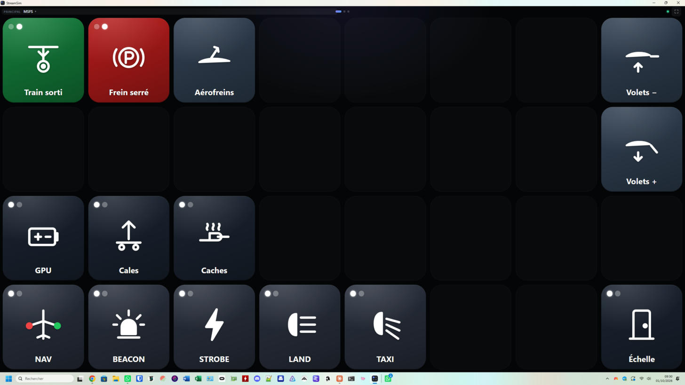

1. Copiez l'APK sur le téléphone et ouvrez-le (autorisez l'installation
   d'applications de sources inconnues si Android le demande).
2. Ouvrez **StreamSim** : le PC apparaît dans « Sur ce réseau ». Touchez-le.
   Sinon, saisissez son adresse IP (menu « Connexion Android » de l'icône StreamSim).
3. L'application se reconnecte automatiquement au dernier PC. Le bouton ▭ en haut à
   droite du Deck (ou la touche Retour) permet de changer de PC.

L'écran reste allumé et s'affiche en plein écran ; les touches vibrent légèrement.
Les touches occupent **tout l'écran**, en portrait comme en paysage : en portrait,
une grille pensée pour le paysage (ex. 3×5) s'affiche en 5×3 (lignes et colonnes
inversées, touches fusionnées comprises) pour garder des touches presque carrées ;
icônes et titres s'agrandissent ou rétrécissent avec les touches.

**Changer de page** : glissez le doigt vers la gauche (page suivante) ou vers la
droite (page précédente), n'importe où sur la grille ; les points en haut de
l'écran restent utilisables. Une touche ne se déclenche qu'au relâchement du
doigt : un glissement ne l'active donc pas. Les boutons rotatifs et curseurs
gardent leur propre glissement.

Sur **Android 7 à 9**, l'affichage du Deck repose sur **Google Chrome** (et sur
**Android System WebView** à partir d'Android 10) : mettez-le à jour depuis le Play
Store. L'application prévient au démarrage si la version est trop ancienne.

**Si l'installation échoue** (« Google Play Store a cessé de fonctionner »,
« Application non installée ») :

- ouvrez l'APK depuis le **gestionnaire de fichiers** plutôt que depuis la
  notification de téléchargement ;
- désinstallez une ancienne version de StreamSim : les versions antérieures à la
  0.6.1 n'ont pas toutes la même signature et ne s'installent pas l'une sur l'autre ;
- désactivez temporairement l'analyse **Play Protect** (Play Store → menu →
  Play Protect), ou videz le cache du Play Store ;
- en dernier recours, depuis le PC : `adb install -r StreamSim-Android-x.y.z.apk`.

### Version et mises à jour

La version installée est affichée partout : à côté du nom **StreamSim** dans
l'interface de configuration, en haut du menu de l'icône de la zone de
notification, et en bas de l'écran de connexion Android.

À chaque lancement, les applications vérifient les versions publiées sur GitHub.
Si une version plus récente existe, **une fenêtre de mise à jour s'affiche
d'elle-même** :

- **PC (Windows, AppImage)** : « Mettre à jour maintenant » télécharge la nouvelle
  version en arrière-plan (progression dans la barre des tâches et dans
  l'interface), puis StreamSim redémarre dessus. « Plus tard » : la pastille
  « Installer la vX » de l'interface et le menu de l'icône permettent de lancer
  la mise à jour quand vous voulez. La vérification est refaite toutes les
  6 heures si StreamSim reste ouvert. Menu de l'icône → « Rechercher une mise à
  jour », ou clic sur le numéro de version, pour vérifier tout de suite.
- **Android** : « Installer » télécharge l'APK puis ouvre l'installeur d'Android
  (confirmez « Installer »). Sur Android 8 et plus, autorisez StreamSim à
  installer des applications la première fois. Si la tablette ne peut pas
  télécharger l'APK depuis GitHub (fréquent sous Android 7), elle le récupère
  **par le PC**, qui le télécharge et le lui transmet sur le Wi-Fi local : gardez
  StreamSim lancé et à jour sur le PC. La vérification est refaite quand
  l'application revient au premier plan après 30 minutes.
  « Rechercher une mise à jour » en bas de l'écran de connexion.

Le dépôt GitHub doit être **public** pour que les applications puissent lire les
versions publiées. La mise à jour automatique d'Android fonctionne à partir de la
0.6.1 (première version signée avec la clé définitive).

## Interface de configuration

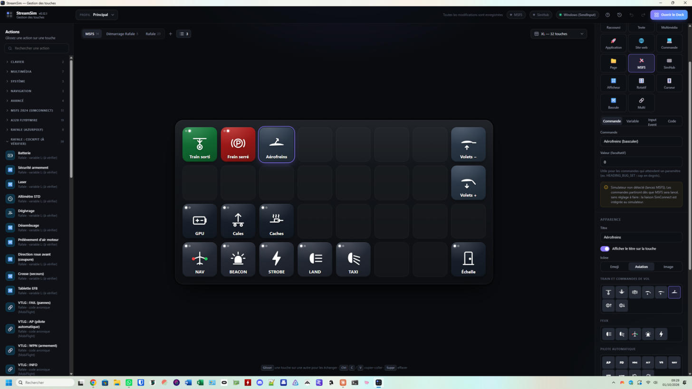

- **Bibliothèque d'actions** (à gauche) : glissez une action sur une touche, ou
  cliquez dessus pour l'appliquer à la touche sélectionnée. Les groupes sont
  repliés par défaut : cliquez sur un titre pour le déplier (l'état est mémorisé).
  Une recherche déplie automatiquement les groupes qui contiennent un résultat.
- **Grille** (au centre) : glissez une touche sur une autre pour les échanger,
  ou sur l'onglet d'une page pour l'y déplacer. Clic droit : tester, copier,
  dupliquer, déplacer, effacer.
- **Inspecteur** (à droite) : type d'action, paramètres, **logiciel cible**,
  titre, icône (emoji ou image) et couleur.
- **Pages** : onglets au-dessus de la grille (double-clic pour renommer, clic
  droit pour les autres options). **Pas de limite de nombre de pages** : des flèches ‹ ›
  font défiler les onglets, le bouton « liste » (avec le nombre de pages) ouvre toutes
  les pages avec une recherche, et sur le Deck, toucher le nom de la page (▾) ouvre la liste de toutes
  les pages ; au-delà de 10 pages, les points deviennent un compteur « 3 / 40 » cliquable. **Glissez un onglet** sur un autre pour changer
  l'ordre des pages (un repère indique où il sera inséré) ; le clic droit propose
  aussi « Déplacer à gauche / à droite / en premier / en dernier ». L'ordre est
  celui du Deck. Une touche « Page » permet de naviguer entre les pages, comme
  les dossiers d'un Stream Deck.
- **Profils** : menu en haut. Le profil sélectionné est celui qu'affiche le Deck.
- **Sauvegardes** : bouton ↺ en haut à droite (ou menu du profil).
  - *Automatiques* : au démarrage et au plus une fois par heure pendant vos
    modifications ; les 30 plus récentes sont gardées.
  - *Manuelles* : « Créer une sauvegarde », avec un nom ; conservées jusqu'à leur
    suppression.
  - *Restaurer* remplace la configuration par celle de la sauvegarde. La
    configuration remplacée est d'abord sauvegardée (« Avant restauration ») et
    Ctrl+Z annule la restauration.
  - Chaque sauvegarde peut être téléchargée (fichier `.json`) ou supprimée.
    « Exporter vers un fichier » et « Importer un fichier » permettent de
    transférer la configuration vers un autre PC (un import est lui aussi
    précédé d'une sauvegarde « Avant import »).
  - Les sauvegardes sont stockées dans le dossier `backups` des données
    (`%APPDATA%\StreamSim\data\backups` sous Windows).
- **Icônes** : trois sources dans l'inspecteur (section *Apparence*) :
  - *Emoji* ;
  - *Aviation* : 36 pictogrammes fournis, classés par groupes (train et commandes de vol,
    feux, pilote automatique, systèmes, radios et divers) ;
  - *Image* : vos propres images, rangées dans la **bibliothèque d'icônes**.
    Cet onglet propose aussi des visuels fournis : interrupteurs à positions, et **point de vue**
    (vue cockpit, vue extérieure, déplacements du siège Haut / Bas / Gauche / Droite / Avant /
    Arrière en trois styles).
  La bibliothèque est un dossier du PC (`icons/` dans le dossier des données, un sous-dossier
  par thème : `icons/mon-avion/train.png`), servi aux Decks à `/user-icons/…`. Menu du profil →
  **Bibliothèque d'icônes** : ajout (glisser-déposer, plusieurs images à la fois), dossiers,
  suppression, **Exporter** / **Importer** (fichier `.json`, comme la configuration, pour
  changer de PC), et « Ranger les images intégrées aux touches » (déplace les images collées
  directement dans les touches vers la bibliothèque : configuration plus légère). Les icônes
  fournies avec l'application sont décrites dans `public/icons/README.md`.
- **Dispositions** : Mini (2×3), Standard (3×5), Plus (4×4) et XL (4×8).
- L'enregistrement est automatique. `Ctrl+Z` / `Ctrl+Y` pour annuler/rétablir.

Raccourcis clavier : flèches pour se déplacer, `Suppr` pour effacer,
`Ctrl+C` / `Ctrl+V` pour copier-coller, `Ctrl+D` pour dupliquer, `Échap` pour désélectionner.

### Types d'action

Dans l'inspecteur, section **Action**, cliquez sur le type voulu (Raccourci,
Texte, MSFS…) : ses réglages apparaissent juste en dessous, et le titre/l'icône
sont conservés en changeant de type.

<p align="center">
  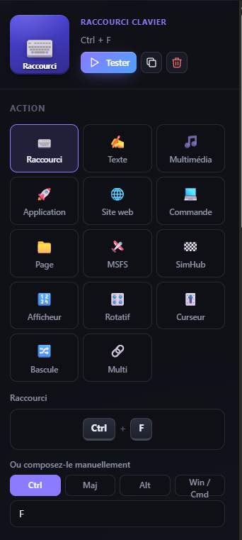
  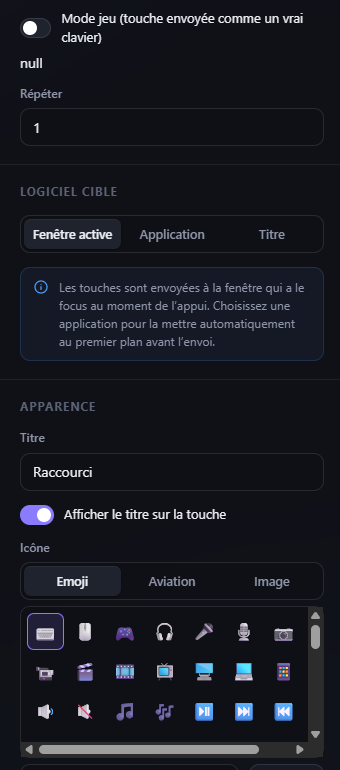
  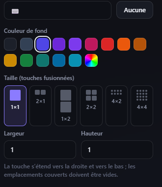
</p>
<p align="center"><sub>Exemple « Raccourci clavier » : le type et le raccourci capturé (<code>Ctrl + F</code>), Mode jeu / Répéter / Logiciel cible, puis Couleur et Taille — ces deux derniers réglages sont communs à tous les types d'action.</sub></p>

| Action | Description |
| --- | --- |
| Raccourci clavier | Combinaison de touches (enregistrée au clavier ou composée à la main), répétable |
| Saisir du texte | Tape un texte (Unicode, accents, emojis), avec Entrée en option |
| Multimédia | Lecture/pause, piste suivante/précédente, stop, volume, muet |
| Lancer une application | Programme, document ou raccourci, avec arguments |
| Ouvrir un site web | Ouvre une adresse dans le navigateur par défaut |
| Commande système | Exécute une commande shell |
| Page | Change la page du Deck (page précise, suivante ou précédente) |
| Multi-actions | Enchaîne plusieurs actions avec des pauses |
| Commande MSFS | Envoie une commande à Microsoft Flight Simulator (SimConnect) |
| Commande SimHub | Déclenche un « Control » SimHub (voir plus bas) |
| Afficheur | Affiche en direct une valeur de SimHub ou de MSFS (vitesse, rapport, temps au tour…) ; un appui peut déclencher une action |
| Bouton rotatif | Tourner (glisser le doigt) pour « + » / « − », appuyer pour valider ; peut afficher une valeur du simulateur |
| Curseur | Glisser pour régler une position (gaz, volets…) ou envoyer des crans « + » / « − » |
| Interrupteur à N positions | Interrupteur à 3 positions, sélecteur à 8 positions… (2 à 12) : une action par position, un appui passe à la suivante (aller-retour ou en boucle), position lue dans le simulateur, visuel par position |
| Bascule (2 états) | Alterne entre deux états (ex. train rentré / sorti) : titre, icône, couleur et action propres à chaque état |

<p align="center">
  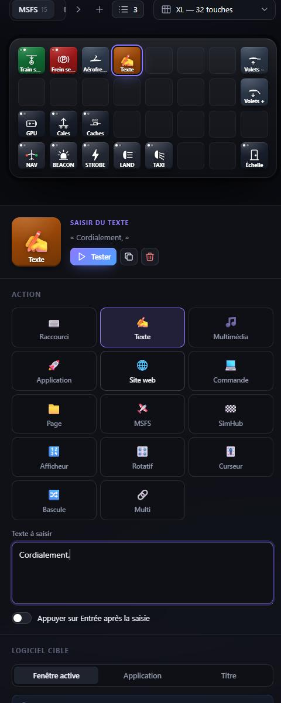
  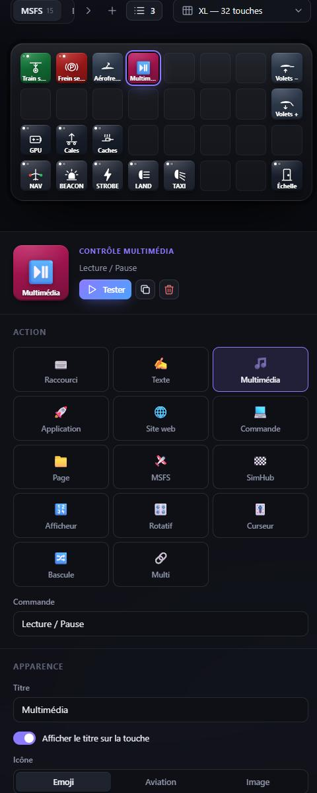
  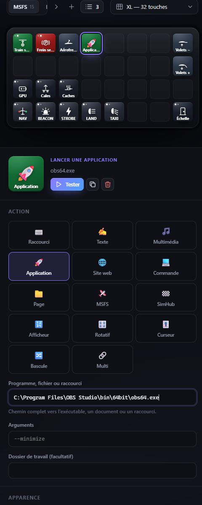
</p>
<p align="center">
  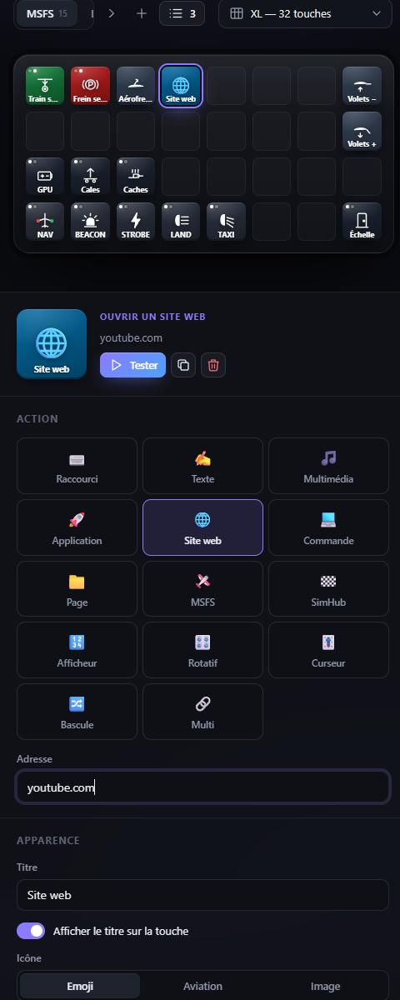
  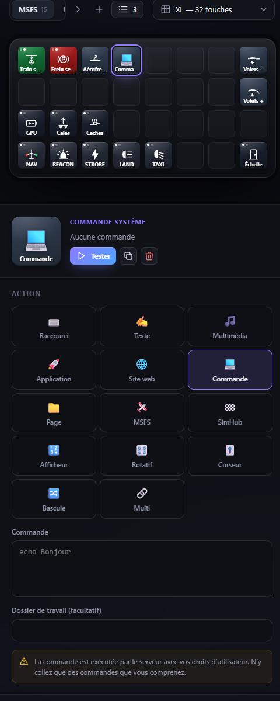
  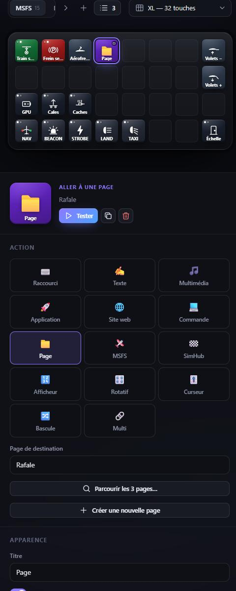
</p>
<p align="center"><sub>Texte, Multimédia, Application, Site web, Commande système, Page.</sub></p>

<p align="center">
  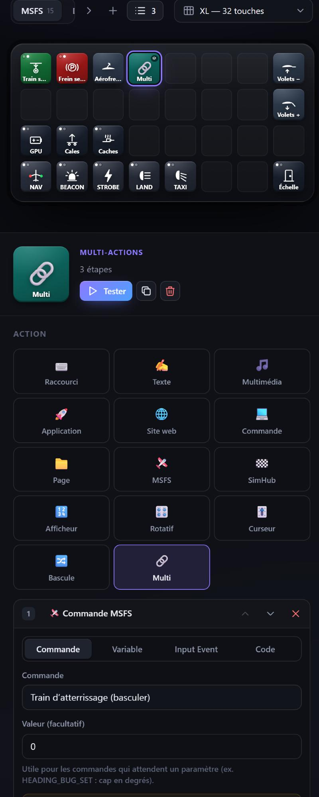
  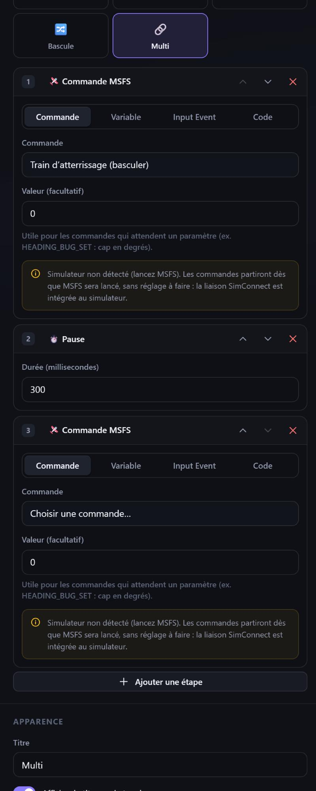
</p>
<p align="center"><sub>Multi-actions : commande MSFS, pause 300 ms, puis une autre commande — réordonnables avec les flèches.</sub></p>

#### Jeux et simulateurs (Assetto Corsa, Le Mans Ultimate…)

Certains jeux ignorent les touches envoyées par un logiciel : ils lisent le clavier par son
code matériel, image par image, et ne voient ni une touche sans code matériel ni une
touche relâchée aussitôt. Sur une touche « Raccourci clavier », cochez **Mode jeu** : la
touche est alors envoyée comme le ferait un vrai clavier (code matériel) et maintenue 60 ms.
La durée d'appui est réglable (champ « Durée d'appui », 60 ms par défaut, de 10 à 500) : augmentez-la
si le jeu manque des appuis. Pour ne pas cocher la case touche par touche, le menu du profil propose
**Mode jeu automatique sur les nouvelles touches** : une fois activé, tout raccourci clavier ajouté
ensuite a le mode jeu déjà coché (les touches existantes ne changent pas). Il n'est pas activé par
défaut, car les autres usages (MSFS, bureautique) n'en ont pas besoin.
Si ça ne suffit pas :

- lancez StreamSim **en administrateur** quand le jeu l'est (Windows n'autorise pas une
  application ordinaire à envoyer des touches à une application élevée) ;
- vérifiez que le jeu est bien la fenêtre active au moment de l'appui (jeu en plein écran
  exclusif : préférez le mode fenêtré sans bordure) ;
- si le jeu (ou son anti-triche, comme EasyAntiCheat) bloque toute entrée logicielle, StreamSim
  n'a pas de moyen de la contourner, et ne cherche pas à le faire : dans ce cas, utilisez
  la fonction de macros ou de boutons du jeu lui-même, ou un périphérique matériel.

### Touches à bascule

<p align="center">
  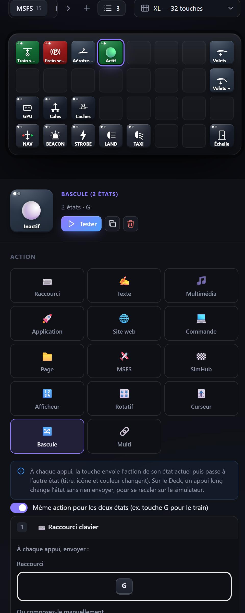
  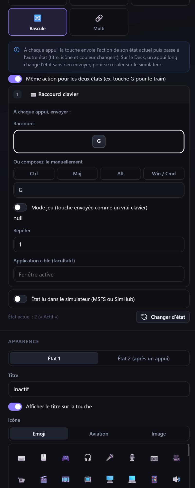
</p>

Une bascule a deux états, chacun avec son titre, son icône, sa couleur et
l'action à envoyer (ou la même action pour les deux, ex. la touche `G` du train
d'atterrissage). À chaque appui, elle envoie l'action de son état puis change
d'état ; deux pastilles indiquent l'état courant.

- L'état est gardé par le PC : le téléphone, la tablette et l'écran de
  configuration affichent toujours le même.
- Si le simulateur se désynchronise (touche pressée au clavier, vol rechargé…),
  un **appui long** sur la touche du Deck change l'état **sans rien envoyer**.
  Le bouton « Changer d'état » de l'inspecteur fait de même.
- Préréglages prêts à l'emploi dans la bibliothèque, catégorie *Simulation* :
  train d'atterrissage, feux d'atterrissage, frein de parc (raccourcis par
  défaut de Microsoft Flight Simulator, modifiables).

### Microsoft Flight Simulator 2024 (et 2020)

StreamSim pilote MSFS directement par **SimConnect**, l'interface officielle
intégrée au simulateur :

- **aucun fichier de configuration** : quand StreamSim tourne sur le même PC que
  le simulateur, la liaison s'établit toute seule dès que MSFS est lancé
  (indicateur « MSFS connecté » en haut de l'écran de configuration) ;
- les commandes partent **même si la fenêtre du simulateur n'a pas le focus**, et
  ne dépendent pas de vos affectations clavier ;
- les touches à bascule affichent **l'état réel** de l'avion (train sorti, feux
  allumés, pilote automatique engagé…), même si vous agissez à la souris dans le
  cockpit.

Dans la bibliothèque, catégorie *MSFS 2024 (SimConnect)* : 37 touches prêtes à
l'emploi (train, frein de parc, volets, aérofreins, compensateur, feux, modes du
pilote automatique, batterie, avionique, pitot, ceintures, radios, pause,
pushback…) avec leurs icônes. L'action « Commande MSFS » donne accès à une
cinquantaine de commandes, ou à n'importe quel événement SimConnect par son nom.
L'onglet *Aviation* du choix d'icône propose 36 icônes dédiées, par groupes.

#### Trois façons d'agir sur le simulateur

L'action « Commande MSFS » propose trois modes, en onglets sous le type
d'action (*Commande*, *Variable*, *Input Event*, *Code*) :

<p align="center">
  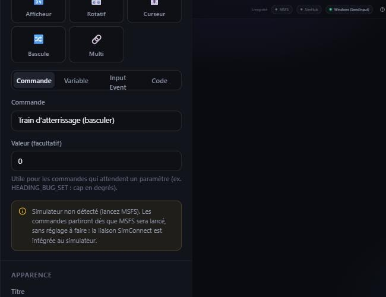
  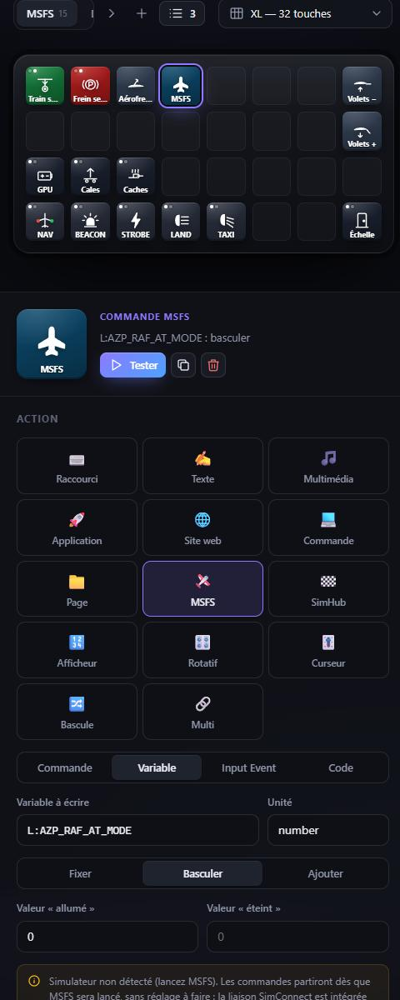
  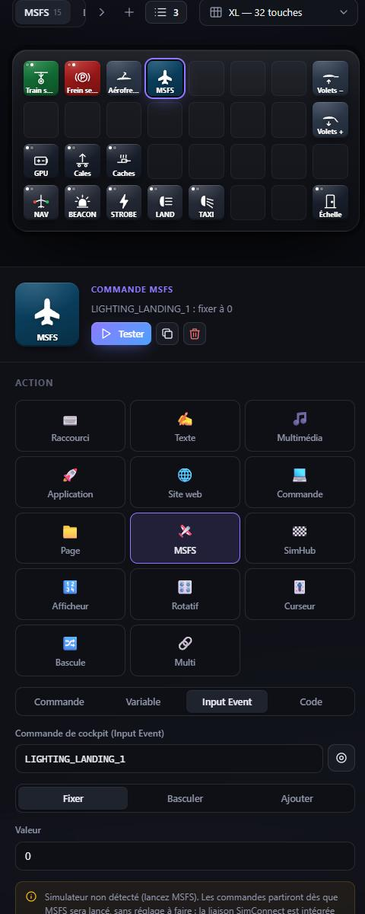
</p>
<p align="center"><sub>Mode <i>Commande</i> (menu classé par catégorie, ici « Train d'atterrissage »), mode <i>Variable</i> (<code>L:AZP_RAF_AT_MODE</code>, Basculer), mode <i>Input Event</i> (<code>LIGHTING_LANDING_1</code>, Fixer).</sub></p>

| Mode | Pour quoi | Exemple |
| --- | --- | --- |
| **Commande** | Événements standard ou personnalisés d'un avion | `GEAR_TOGGLE`, `A32NX.FCU_HDG_PUSH` |
| **Variable** | Écrire une SimVar ou une variable locale `L:` d'un avion | `L:…` : fixer, basculer 0 ↔ 1, ajouter un pas |
| **Input Event** | Commandes de cockpit de MSFS 2024 (avion chargé) | `LIGHTING_LANDING_1` : fixer, basculer, ajouter |

L'état d'une bascule, la valeur affichée par un bouton rotatif et la position d'un
curseur peuvent de même être lus dans une SimVar, une variable `L:` ou un Input
Event. Pour une bascule, l'option « État 2 si la valeur vaut… » permet par
exemple d'allumer une touche seulement quand l'auto-freinage est sur MED.

#### Explorateur MSFS

Cliquez sur l'indicateur **MSFS** en haut de l'écran de configuration :
l'explorateur liste les commandes de cockpit (Input Events) **de l'avion
chargé**, avec une recherche et la lecture de leur valeur actuelle. Actionnez un
interrupteur dans le cockpit puis relisez pour repérer la bonne commande. Il lit
aussi n'importe quelle variable (`L:` ou SimVar) et exporte la liste des
commandes. C'est l'outil pour configurer un avion non documenté (ex. le Rafale
d'AzurPoly).

#### Airbus A320neo FlyByWire

Catégorie *A320 FlyByWire*, construite à partir de la documentation officielle
FlyByWire, sans module supplémentaire :

- boutons **SPD, HDG, ALT, V/S** et **BARO** : tourner = régler, **appui =
  enfoncer (managé)**, **appui long = tirer (sélecté)** ; la touche affiche la
  valeur du FCU, les tirets « --- » et le point du mode managé ;
- **AP1, AP2, A/THR, LOC, APPR, EXPED, FD, LS** avec leur voyant ;
- pas d'altitude 100 / 1000, HDG-V/S / TRK-FPA, SPD / MACH ;
- **auto-freinage LO / MED / MAX** (la touche du mode armé s'allume).

#### Rafale (AzurPoly, MSFS 2024)

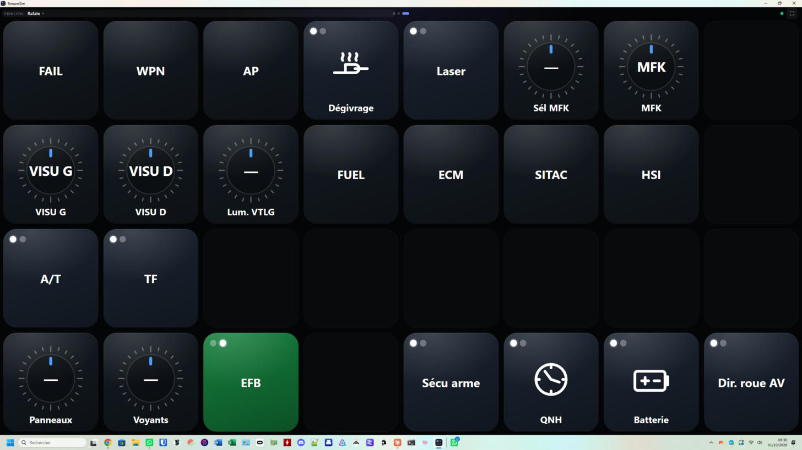

Catégorie *Rafale (AzurPoly)*, construite à partir des Input Events exposés par
l'avion (liste exportée depuis l'explorateur). Chaque touche lit l'état réel dans
le simulateur :

- **train d'atterrissage**, **frein de parc**, **aérofreins** ;
- au sol : **échelle pilote**, **groupe de parc (GPU)** et **prise GPU**, **cales**,
  **caches et protections** (tous en un appui : entrées d'air, pitot, AOA,
  antennes…).

Catégorie *Rafale : cockpit (à vérifier)*, construite à partir des variables `L:`
relevées dans l'avion (fenêtre *Behaviors* de MSFS 2024) : batterie, sécurité
armement, laser, altimètre STD, dégivrage, désembuage, prélèvement d'air moteur,
coupure de la direction de roue avant, crosse de secours, tablette EFB ; molettes d'éclairage
et de luminosité des écrans (de 0 à 100 %, ± 5 % par cran). AzurPoly ne documente pas
l'écriture de ces variables : si une touche n'a pas d'effet dans le cockpit, c'est
que l'avion ne fait que lire cette variable pour son affichage.

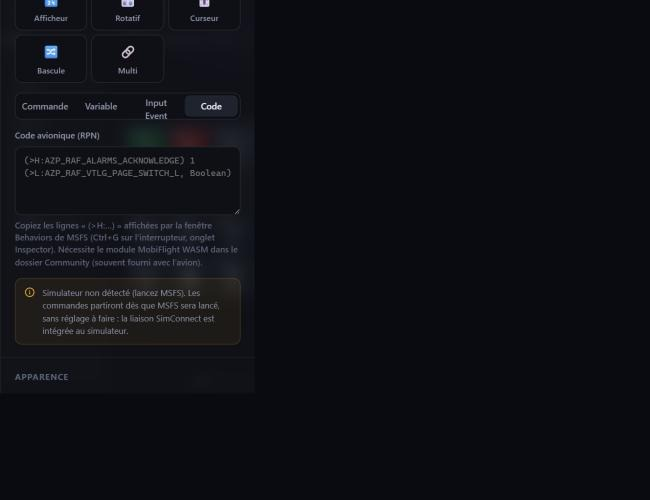

**Code avionique (événements `H:` et `B:`).** Beaucoup d'interrupteurs du Rafale
ne changent qu'une variable `L:` pour leur animation : la vraie fonction passe par
des événements `H:` que SimConnect ne sait pas déclencher. Commande MSFS → mode
**Code** : saisissez le code affiché par l'Inspector (Ctrl+G sur l'interrupteur),
par exemple `(>H:AZP_RAF_ALARMS_ACKNOWLEDGE) 1 (>L:AZP_RAF_VTLG_PAGE_SWITCH_L, Boolean)`.
Il est exécuté par le module gratuit **MobiFlight WASM** (dossier *Community* de
MSFS, souvent fourni avec les avions complexes) ; le journal indique s'il est
détecté. Touches fournies (groupe *Rafale : cockpit*), reprenant toutes les
commandes de la documentation AzurPoly (*Custom variables and events*) :

- pages du VTLG **FAIL**, **AP**, **WPN** et **INFO**, et du VTLD (écran tactile de
  droite) **HSI**, **FUEL**, **ECM** et **SITAC** ;
- **molettes de visualisation** gauche et droite, et **molette multifonction
  (MFK)** : tourner = régler (altitudes, vitesses…), appui = valider ; sélecteur
  de mode de la MFK (R1, R2, H, BULL, BINGO, DEST, ALT, affiché sur la touche) ;
- pilote automatique : marche/arrêt, **A/T**, **TF** (état affiché), molette
  d'altitude cible ;
- commandes moteur auxiliaires **AEC** gauche et droite (STOP, IDLE, NORM, FIX), avec un visuel de levier par position ;
- **APU** et **ECS** (climatisation, démarre l'APU si besoin), avec un visuel
  éteint / allumé (l'APU suit l'état réel de l'avion ; l'ECS, dont la variable n'est pas relevée, celui de la touche) ;
- **sélecteur de source électrique 5K** (OFF, TEST, STBY, NORM, START L, START R), en
  touche 2 × 2 dont le visuel suit la position réelle du sélecteur dans l'avion ;
- acquittement des alarmes, **largage d'urgence**, rechargement du canon ;
- **sécurité des générateurs (GEN SAFETY)** ;
- **FCS TEST** : capot de protection (la touche suit son état) et test court, utilisable capot ouvert.

Le Rafale n'expose pas ses systèmes de cockpit (armement, écrans, pilote
automatique…) sous forme d'Input Events : ils passent par ses variables `L:`.
Pour les trouver, activez le mode développeur de MSFS 2024, puis *Tools →
Behaviors* → onglet *LocalVariables* ; une variable se teste avec « Lire une
variable » de l'explorateur, puis s'utilise dans une touche (commande MSFS →
*Variable*, ou bascule synchronisée).

> Certains avions très détaillés ont leurs propres systèmes et ignorent une partie
> des commandes standard : utilisez alors leurs commandes personnalisées, leurs
> variables `L:` ou leurs Input Events (voir l'explorateur), ou à défaut des
> raccourcis clavier (catégorie *Simulation (raccourcis clavier)*).

La liaison utilise la bibliothèque [node-simconnect](https://github.com/EvenAR/node-simconnect)
(licence LGPL-3.0).

### SimHub

StreamSim dialogue avec [SimHub](https://www.simhubdash.com/) grâce au plugin
gratuit **SimHub Property Server** ([pre-martin/SimHubPropertyServer](https://github.com/pre-martin/SimHubPropertyServer)) :

1. Téléchargez `PropertyServer.dll` depuis la page *Releases* du plugin et copiez-le
   dans le dossier d'installation de SimHub (SimHub 9.6 minimum).
2. Relancez SimHub et activez le plugin (*Settings → Plugins*).
3. La pastille **SimHub** de l'interface de configuration passe au vert.
   StreamSim se connecte à `127.0.0.1:18082` et se reconnecte tout seul si
   SimHub est relancé (autre PC ou autre port : variables d'environnement
   `SIMHUB_HOST` et `SIMHUB_PORT`).

Ce que l'on peut faire :

<p align="center">
  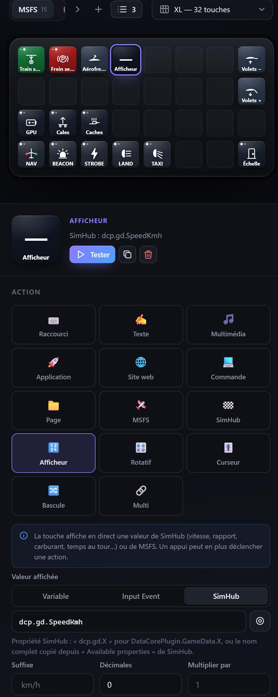
  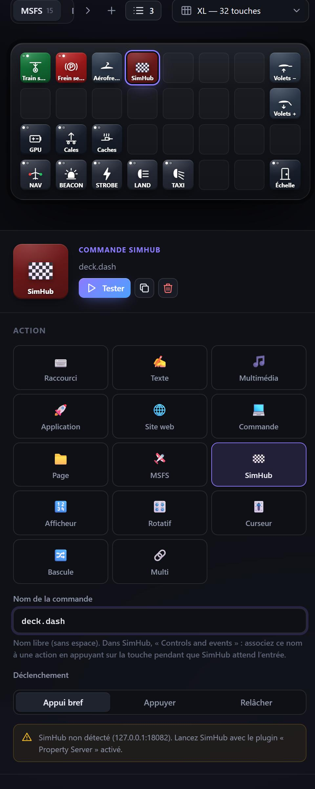
</p>

- **Afficheurs** (groupe *SimHub* de la bibliothèque) : vitesse, rapport, régime,
  carburant, position, tours, tour en cours, dernier et meilleur tour, niveaux
  d'antipatinage et d'ABS, répartition de freinage… La valeur se met à jour en
  direct (10 fois par seconde au plus). Toute propriété SimHub peut être affichée :
  `dcp.gd.X` pour `DataCorePlugin.GameData.X`, ou le nom complet copié dans
  *Available properties* de SimHub. Le bouton ◎ charge la liste des propriétés
  connues depuis SimHub. Options : suffixe, décimales, format « temps au tour ».
- **Bascules synchronisées** : l'état d'une touche suit une propriété SimHub
  (limiteur de stand, contact, DRS…). L'action de la touche reste au choix, par
  exemple la touche clavier du jeu. Une propriété texte peut être comparée à un
  texte (ex. rapport « R »).
- **Commande SimHub** : déclenche un « Control » SimHub. Donnez-lui un nom libre
  (ex. `deck.dash`) ; dans SimHub, *Controls and events*, créez un mappage et
  appuyez sur la touche du Deck quand SimHub attend l'entrée. Vous pouvez ainsi
  changer d'écran de tableau de bord, régler le ShakeIt, etc. Modes : appui bref,
  appuyer ou relâcher (pour un maintien).
- **Boutons rotatifs** et **curseurs** : leur valeur affichée ou leur position
  peut aussi venir de SimHub.

### Boutons rotatifs et curseurs

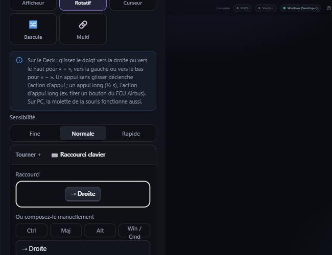

**Bouton rotatif** (catégorie *Avancé*, ou préréglages MSFS HDG, ALT, VS, SPD,
CRS, BARO, molette de compensateur) : l'inspecteur demande une action pour
« Tourner + » et une pour « Tourner − » (ici deux raccourcis clavier, Droite et
Gauche) — n'importe quel type d'action convient, pas seulement les raccourcis.

- sur le Deck, glissez le doigt vers la droite ou vers le haut pour « + », vers
  la gauche ou vers le bas pour « − » ; chaque cran envoie l'action correspondante
  (sensibilité fine, normale ou rapide) ;
- **un appui sans glisser déclenche l'action d'appui** : valider une valeur,
  engager un mode du pilote automatique, caler l'altimètre… ;
- sur PC, la molette de la souris tourne le bouton ;
- le bouton peut afficher en direct une valeur de MSFS (cap sélecté « 275° »,
  altitude « 12 000 ft », calage « 1013 hPa »…).

**Curseur** (préréglages MSFS : manette des gaz, volets, aérofreins, mélange,
pas d'hélice) :

<p align="center">
  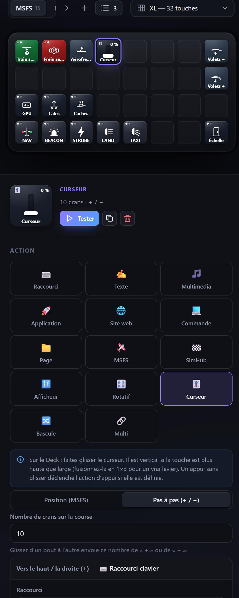
  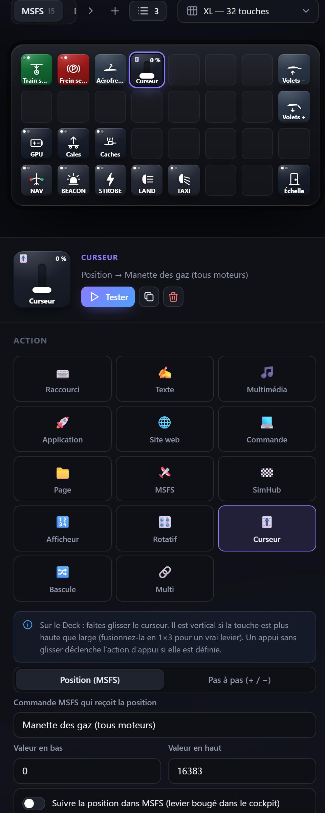
</p>
<p align="center"><sub>Mode <i>Pas à pas</i> (nombre de crans réglable) et mode <i>Position (MSFS)</i> (ici « Manette des gaz », 0–16383, suivi de la position réelle).</sub></p>

- vertical si la touche est plus haute que large : fusionnez-la en 1×3 pour
  obtenir un vrai levier ; horizontal sinon ;
- mode *Position (MSFS)* : la position est envoyée en continu au simulateur
  (ex. `THROTTLE_SET` de 0 à 16383) et le curseur suit le levier si vous le
  bougez dans le cockpit ;
- mode *Pas à pas* : glisser d'un bout à l'autre envoie un nombre réglable de
  « + » ou de « − » (raccourcis clavier, commandes…), pour n'importe quel logiciel ;
- un appui sans glisser déclenche l'action d'appui si elle est définie, sinon le
  curseur saute à l'endroit touché.

### Touches fusionnées

Dans l'inspecteur, section *Apparence › Taille*, une touche peut occuper
plusieurs emplacements : 2×1, 1×2, 2×2, 4×2, 4×4… selon la disposition choisie.
Elle s'étend vers la droite et vers le bas ; les emplacements couverts doivent
être libres.

### Logiciel cible

Pour les raccourcis et le texte, vous pouvez choisir le logiciel destinataire :

- **Fenêtre active** : les touches partent vers la fenêtre au premier plan ;
- **Application** : nom du processus (`obs64`, `chrome`, `Discord`…) ;
- **Titre** : texte contenu dans le titre de la fenêtre.

L'application est mise au premier plan, puis les touches lui sont envoyées. Le
bouton ⟳ liste les fenêtres ouvertes pour vous aider à choisir.

## Envoi des touches selon le système

| Système | Méthode | Prérequis |
| --- | --- | --- |
| Windows | API `SendInput` via un agent PowerShell persistant | Aucun |
| macOS | AppleScript (`System Events`) | Autoriser le terminal dans *Réglages › Confidentialité › Accessibilité* |
| Linux (X11) | `xdotool` (+ `wmctrl` pour lister les fenêtres) | `sudo apt install xdotool wmctrl` |

L'indicateur en haut de l'interface de gestion signale si l'envoi est opérationnel.

## Sécurité

- Par défaut, **seul l'ordinateur hôte** peut modifier la configuration ou
  tester des actions. Les autres appareils du réseau peuvent uniquement appuyer
  sur les touches déjà configurées.
- L'API refuse les requêtes provenant d'autres sites web (protection CSRF et
  DNS rebinding).
- Les actions « Commande système » s'exécutent avec vos droits d'utilisateur.

## En cas de problème

- Sur la tablette, « Le PC ne répond pas » signifie que la tablette ne joint plus le
  PC : vérifiez le Wi-Fi de la tablette et que StreamSim est lancé sur le PC. Le Deck
  se reconnecte tout seul dès que le réseau revient.
- Pendant son affichage, l'application Android garde le Wi-Fi en mode « haute
  performance » (pas de mise en veille). Si le Wi-Fi de la tablette se coupe malgré
  tout, désactivez l'économie d'énergie du Wi-Fi dans les réglages d'Android
  (Wi-Fi → Paramètres avancés → « Wi-Fi activé en veille : Toujours »).

- L'application PC tient un **journal** (`streamsim.log`) : menu de l'icône →
  « Ouvrir le journal (diagnostic) ». Joignez-le pour signaler un problème. Une
  erreur imprévue y est enregistrée sans arrêter le serveur.

## Configuration du serveur

Variables d'environnement (serveur seul, et application PC pour `PORT`) :

| Variable | Défaut | Rôle |
| --- | --- | --- |
| `PORT` | `3210` | Port HTTP (la découverte réseau utilise toujours l'UDP 3211) |
| `HOST` | `0.0.0.0` | Interface d'écoute (`127.0.0.1` pour interdire l'accès réseau) |
| `DECK_DATA_DIR` | `./data` | Dossier de la configuration (`config.json`) |
| `DECK_REMOTE_ADMIN` | — | `1` : autorise la configuration depuis un autre appareil |
| `DECK_DRY_RUN` | — | `1` : mode simulation, les actions sont journalisées sans être envoyées |

L'application PC range sa configuration dans le dossier utilisateur
(`%APPDATA%\StreamSim\data` sous Windows).

## Développement

Prérequis : [Node.js](https://nodejs.org) 18+ (22 recommandé). Pour Android : JDK 17 et le SDK Android (ou Android Studio).

```bash
npm start              # serveur seul, sans dépendance → http://localhost:3210/
npm install            # dépendances de l'application PC (Electron)
npm run desktop        # application PC en mode développement
npm run dist:win       # installateur Windows dans dist/
npm test               # tests unitaires

cd android && ./gradlew assembleRelease   # APK dans android/app/build/outputs/apk/release/
```

Le projet `android/` s'ouvre aussi directement dans Android Studio.

### Numéros de version

- `package.json` : version de la publication (application PC, serveur, Deck affiché
  sur la tablette, qui est servi par le PC).
- `android/app/build.gradle.kts` (`versionName`, `versionCode`) : version propre à
  l'application Android, qui ne change que si le code de `android/` change. L'APK
  publié porte ce numéro (`StreamSim-Android-x.y.z.apk`) et la tablette ne propose
  une mise à jour que s'il est plus récent que le sien. `versionCode` doit toujours
  augmenter quand l'application Android change.

### Signature de l'APK

Toutes les versions publiées doivent être signées avec **la même clé**, sinon
Android refuse d'installer une mise à jour par-dessus la précédente. La clé n'est
pas dans le dépôt : la CI la lit dans les secrets GitHub (Settings → Secrets and
variables → Actions) :

| Secret | Contenu |
|---|---|
| `ANDROID_KEYSTORE_BASE64` | le fichier `.jks`, encodé en base64 |
| `ANDROID_KEYSTORE_PASSWORD` | mot de passe du fichier |
| `ANDROID_KEY_ALIAS` | alias de la clé |
| `ANDROID_KEY_PASSWORD` | mot de passe de la clé |

Création de la clé (une seule fois, `keytool` est fourni avec Java / Android Studio),
puis encodage en base64 sous Windows (PowerShell) :

```powershell
keytool -genkeypair -keystore streamdeck.jks -alias streamdeck -keyalg RSA -keysize 2048 -validity 36500
[Convert]::ToBase64String([IO.File]::ReadAllBytes("streamdeck.jks")) | Set-Clipboard
```

Conservez `streamdeck.jks` et ses mots de passe en lieu sûr : sans eux, les
prochaines versions ne pourront plus mettre à jour l'application installée.
Sans secrets, la CI compile avec une clé de débogage temporaire, et la
publication d'une version est refusée. En local, définissez `SIGNING_STORE_FILE`,
`SIGNING_STORE_PASSWORD`, `SIGNING_KEY_ALIAS` et `SIGNING_KEY_PASSWORD`.

## Structure

```
server/
  app.js              Serveur HTTP : API REST, flux temps réel (SSE), fichiers statiques
  index.js            Lancement du serveur seul (npm start)
  discovery.js        Découverte réseau (UDP 3211) pour l'application Android
  msfs.js             Liaison Microsoft Flight Simulator (SimConnect)
  simhub.js           Liaison SimHub (plugin Property Server, TCP 18082)
  update.js           Recherche des nouvelles versions publiées sur GitHub
  backups.js          Sauvegardes de la configuration (automatiques et manuelles)
  states.js           États des touches à bascule
  store.js            Configuration (validation, écriture atomique)
  actions.js          Exécution des actions
  executors/          Envoi des touches : windows.js (+ agent .ps1), macos.js, linux.js
shared/keys.js        Définition des touches, commune au serveur et à l'interface
shared/layout.js      Placement des touches (fusion, orientation), bascules
shared/controls.js    Boutons rotatifs et curseurs : conversions, affichage des valeurs
shared/msfs.js        Catalogue MSFS : commandes, variables, préréglages
shared/simhub.js      Catalogue SimHub : propriétés courantes, préréglages
public/icons/aviation/           Icônes aviation par groupe (SVG)
public/icons/touches-completes/  Visuels de touche entiers, par avion (SVG)
server/icons.js       Bibliothèque d'icônes de l'utilisateur (dossiers, export, import)
public/               Interface de configuration (index.html) et Deck (deck.html)
desktop/              Application PC (Electron) : fenêtre, zone de notification
android/              Application Android (Kotlin) : connexion, découverte, Deck plein écran
scripts/smoke.mjs     Test de fumée utilisé par l'intégration continue
scripts/fake-msfs-server.mjs  Serveur relié à un faux simulateur (développement)
test/fake-simconnect.js       Faux SimConnect (tests et développement)
.github/workflows/    Compilation et publication (APK, installateurs)
test/                 Tests unitaires
## Tests

```bash
npm test
```
